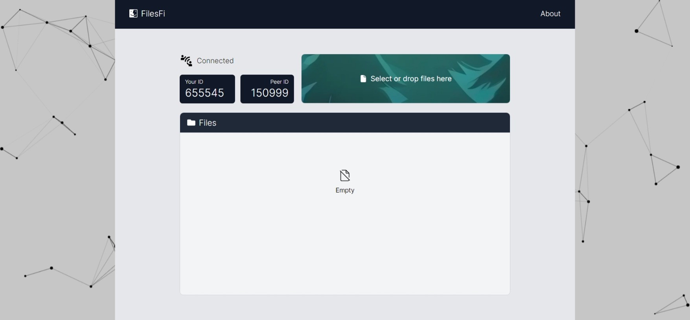

# FilesFi - Share files with ease

This project was made to share files directly from one device to another through the use of WebRTC technology. It generates 6-digit unique ID for every connected device. The user can then share the ID with the other user to connect with them. Once the connection is established users can exchange unlimited number of files directly. This is similar to torrent in terms of its working principle. It can also be used to exchange big files.

This is an OSS (Open Source Software) and its entire codebase can be found on Github. It's a webapp and there's a separate server and repository for [backend](https://github.com/41y08h/filesfi-api) and [frontend](https://github.com/41y08h/filesfi-client).
